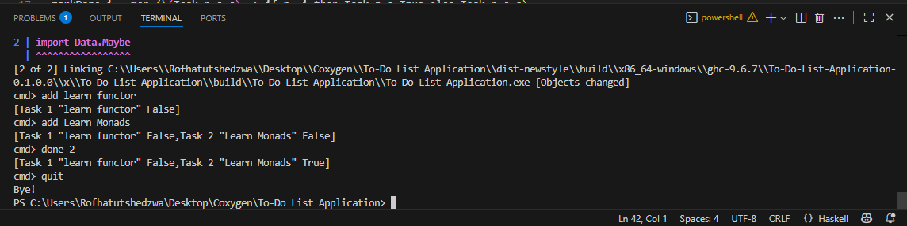

# Haskell To-Do List Manager

A **simple command-line To-Do List Manager** written in **Haskell**.
This project demonstrates real-world **functional programming concepts**:

* ✅ **map** (applied to tasks)
* ✅ **Semigroup & Monoid** (combining task lists)
* ✅ **Functor / Applicative / Monad** (via `Maybe` and parsing)
* ✅ **IO side effects** (user input/output loop)

---

## ✨ Features

* Add multiple tasks
* List all tasks
* Mark tasks as done
* Quit the app

---

## 🚀 Usage

### 1. Compile

```bash
ghc Main.hs -o todo
```

### 2. Run

```bash
./todo
```

### 3. Example Session

```
cmd> add Learn Functor
[Task 1 "Learn Functor" False]
cmd> add Practice Monad
[Task 1 "Learn Functor" False,Task 2 "Practice Monad" False]
cmd> list
[Task 1 "Learn Functor" False,Task 2 "Practice Monad" False]
cmd> done 1
[Task 1 "Learn Functor" True,Task 2 "Practice Monad" False]
cmd> quit
Bye!
```

---

## 📚 Concepts Shown

* **map**: used in `markDone` to update task lists.
* **Semigroup / Monoid**: `TaskList` can be combined with `<>`, empty list is `mempty`.
* **Functor / Applicative**: parsing input numbers with `Maybe` and `<$>`, `<*>`.
* **Monad**: `IO` Monad sequences input/output, `Maybe` Monad handles parsing safely.
* **Side Effects**: interactive console input/output.

---

## 🛠 Requirements

* [GHC (Glasgow Haskell Compiler)](https://www.haskell.org/ghc/)

---

## 📄 License

MIT

---

## Screenshot


